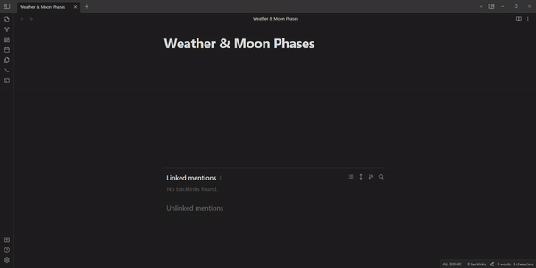

# Obsidian Weather & Moon Phases Plugin 

This is a plugin for [Obsidian](https://obsidian.md) that inserts the current weather and moon phase into your notes.

As of now, this plugin only supports the following weather providers:
- [WTTR.in](https://wttr.in)

## Features
- Insert the current weather (single-line).
- Insert the current Moon phase and day.

## Installation
- Clone this repo.
- `npm i` or `yarn` to install dependencies
- `npm run build` to generate build.
- Copy the contents of the build folder to your vault `VaultFolder/.obsidian/plugins/obsidian-weather-moon/`.
- Reload installed plugins in Obsidian settings.

## Usage
- Open the command palette (Ctrl/Cmd + P) and type `Weather & Moon` to see the available commands.
- The commands are:
    - `Current weather`: Inserts the current weather.
    - `Moon phase`: Inserts the current Moon phase and day.
- The command palette can also be opened by typing '/' followed by the command.

## Settings
- Location: This should be a city name, or a city name followed by a comma and a Country. For example, "London" or "London, UK".
- Units: This should be either "metric" or "imperial".

## Feedback
If you have any feedback, please feel free to open an issue on the [GitHub repo](https://github.com/mubarizahmed/obsidian-weather-moon/issues). 

## Credits
- [WTTR.in](https://wttr.in) for the weather data.

